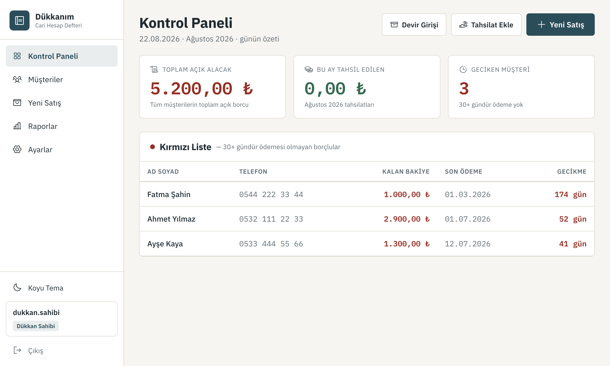
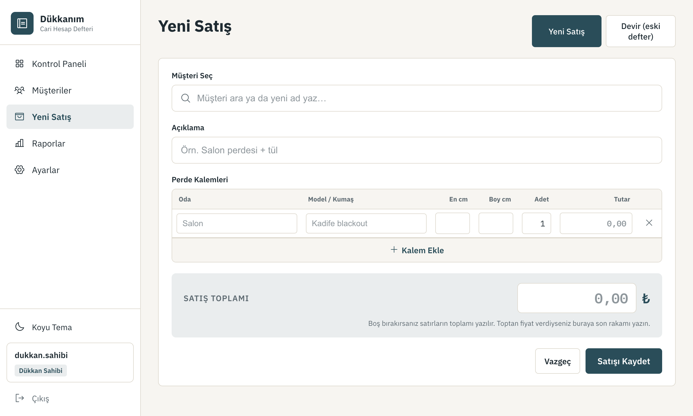
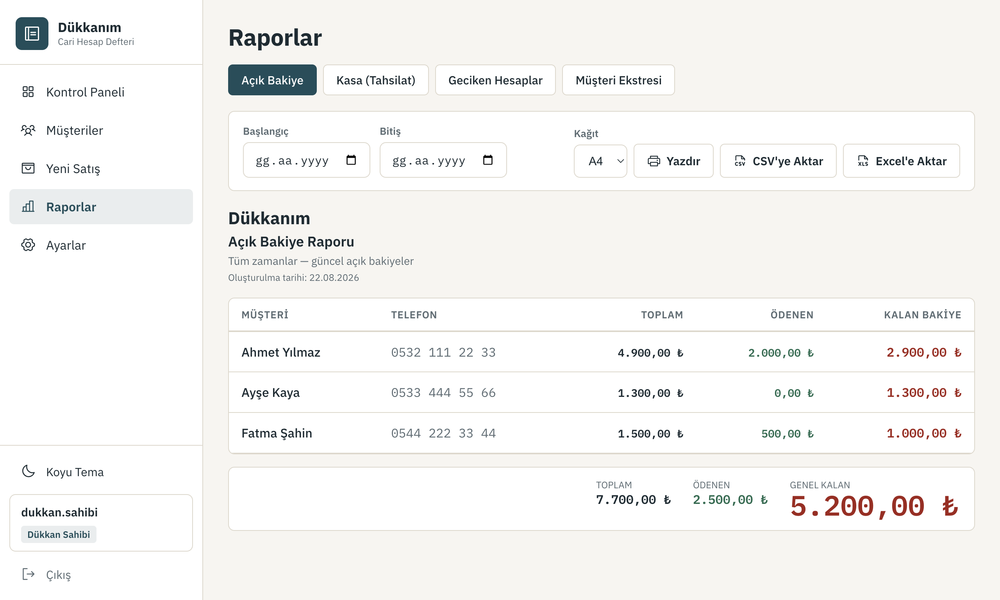

# Veresiye — Cari Hesap Defteri

> Kağıt defterde tutulan **satış, ölçü ve açık hesap (veresiye) takibini** üstlenen, **internetsiz çalışan** bir Windows masaüstü programı. Ölçüyle iş yapan küçük esnaf (perde, mobilya, doğrama) düşünülerek tasarlandı.

**Durum:** ✅ Çalışır, güncel sürüm `v1.0.0` · **Maliyet:** Sıfır (tümüyle ücretsiz/açık kaynak) · **Arayüz:** Baştan sona Türkçe



---

## Bu program ne yapar?

Dükkândaki tüm kayıtlar bugüne kadar **kağıt defterde** tutuluyordu. Bu program o defterin yerini alır: müşteri, satış, perde ölçüsü ve **düzensiz tutarlı ödemelerle** işleyen açık hesabı yönetir.

Kullanıcı profili teknik değildir (ömürleri defter tutmakla geçmiş esnaf). Bu yüzden arayüz **defter kadar basittir**: az buton, büyük yazı, net Türkçe, para her zaman öne çıkar (borç kırmızı, ödeme yeşil).

**Tek formül:** `Kalan Bakiye = Toplam Borç − Yapılan Ödemeler` (sabit taksit yok; bakiye asla elle girilmez, her zaman canlı hesaplanır).

## Öne çıkan özellikler

- 🧾 **Cari hesap takibi** — müşteri, satış, çok kalemli perde satırları (oda/model/en/boy/adet + **elle girilen satır tutarı**), tahsilat; peşinat ayrı alan değil, ilk tahsilattır.
- 📓 **Eski defter aktarımı (Devir)** — ~1000 kaydı sadece klavyeyle, "Kaydet ve Yeni Ekle" ile hızlı giriş. Tek tük kayıtlar için müşteri eklerken **açılış bakiyesi** alanı.
- 🔴 **Kırmızı liste** — 30+ gündür ödemesi olmayan borçlular (yalnızca ekranda; SMS/WhatsApp gönderilmez).
- 📊 **4 rapor** — Açık Bakiye, Kasa (tahsilat), Geciken Hesaplar, Müşteri Ekstresi; tarih filtresi, **A4/A3** yazdırma, **CSV/Excel** dışa aktarma, çıktıların üstünde **dükkan logosu**.
- 💡 **Otomatik öneri** — Oda ve Model/Kumaş kutuları daha önce yazılanları hatırlar ("mu" → Mutfak); en çok kullanılan üstte. Yaygın odalar hazır gelir, kumaş listesi kullandıkça dolar.
- 🏷️ **Toptan / indirimli fiyat** — perde ölçüleri girilir, satır tutarları boş bırakılabilir; "Satış Toplamı" kutusuna anlaşılan son rakam yazılır. Satır toplamıyla fark varsa ekran indirimi gösterir.
- 💾 **Yedekleme (zorunlu)** — her akşam 23.55'te + her açılışta otomatik yedek, bilgisayarda son 5 yedek saklanır, **"Bilgisayara Yedek Al"** ile istenildiği an elle yedek, USB'ye tek tık yedek, güvenli **geri yükleme** (geri-yükleme-öncesi otomatik yedek + dosya doğrulama), 7 gün uyarı şeridi **+ açılışta hatırlatma penceresi**.
- 👤 **Roller** — Dükkan Sahibi (her şey) / Çalışan (kayıt ekler ve yedek alabilir; silemez/düzenleyemez, geri yükleyemez). Yerel giriş, şifreler `bcrypt` ile hash'li.
- 🔌 **Tam çevrimdışı** — hiçbir dış servise (CDN, API, bulut) bağlı değildir; internet olmadan tam çalışır. Tüm veri tek bir yerel SQLite dosyasındadır.
- 💰 **Para kuruşu kuruşuna** — tüm para alanları kuruş cinsinden tamsayı; yuvarlama hatası yok. Biçim `12.500,00 ₺`, tarih `GG.AA.YYYY`.

## Ekran görüntüleri

| Yeni Satış | Açık Bakiye Raporu |
|---|---|
|  |  |

## Teknoloji

Masaüstü (Electron) + web arayüzü (React) + gömülü veritabanı (SQLite). Şartname internetsiz/tek bilgisayar/çift-tık kurulum şartı koyduğu için bulut (Next.js/Supabase/Vercel) **kullanılmadı**. Gerekçeler: [`dokumanlar/MIMARI.md`](dokumanlar/MIMARI.md).

| Katman | Araç |
|---|---|
| Kabuk | Electron 43 |
| Arayüz | React 19 + TypeScript |
| Geliştirme/derleme | electron-vite (Vite) |
| Veritabanı | better-sqlite3 (yerel SQLite, tek dosya) |
| Veri erişimi | Tek "repository" katmanı — ileride SQLite→PostgreSQL geçişi tek yerden |
| Paketleme | electron-builder (Windows NSIS `.exe`) |
| Şifre | bcryptjs (saf JS, hash) |
| Rapor/Excel | Yerleşik CSV (UTF-8) + exceljs |

## Kurulum (son kullanıcı)

Windows kurulum dosyasını indirip çift tıklayın — internet gerekmez:

**➡️ [Sürüm sayfası (Releases)](https://github.com/ademtfkc/veresiye/releases/tag/v1.0.0)** → `Veresiye.Setup.1.0.0.exe` (≈110 MB)

Ayrıntılı, sade Türkçe adımlar (SmartScreen uyarısı, ilk hesap, günlük kullanım, yedekleme): **[`dokumanlar/KULLANIM_REHBERI.md`](dokumanlar/KULLANIM_REHBERI.md)**

> Program imzalı bir sertifika taşımadığı için Windows ilk açılışta "Windows bilgisayarınızı korudu" uyarısı gösterebilir → **Daha fazla bilgi → Yine de çalıştır**.

## Geliştirme

Gereksinim: Node.js 20+ (geliştirmede 26 kullanıldı). Geliştirme macOS'ta, teslim Windows'a.

```bash
npm install         # bağımlılıklar (better-sqlite3 Electron ABI'sine göre derlenir)
npm run dev         # programı pencerede aç (canlı yenileme)
npm run typecheck   # TypeScript hata taraması
npm run build       # main + preload + renderer derle
npm run dist        # Windows .exe üret (electron-builder)
```

**Testler** (hepsi gerçek Electron çalışma zamanıyla koşar):

```bash
npm run db:test       # veri katmanı: bakiye, devir, kapanış, arama (32 kontrol)
npm run backend:test  # servis/IPC: bakiye, gecikme, rol yetkisi, giriş (50+ kontrol)
npm run rapor:test    # 4 rapor + kasa kırılımı + ekstre yürüyen bakiye
npm run migration:test # şema yükseltmesi mevcut rakamları bozmuyor mu (v3 → v4)
npm run yedek:test    # yedek al + 5 yedek sınırı + 23.55 zamanlaması + güvenli geri yükleme (A→B→A)
```

## Proje yapısı

```
src/
├─ main/                 # ANA SÜREÇ (Node/Electron)
│  ├─ db/                #   veri katmanı: connection, migrations, repositories (TÜM SQL burada)
│  ├─ services/          #   iş mantığı: bakiye, gecikme, panel, satış, tahsilat, rapor, yedek
│  ├─ ipc/               #   güvenli köprü uçları + yetki.ts (rol kontrolü TEK yerde)
│  └─ auth/              #   yerel giriş, bcrypt, oturum
└─ renderer/             # ARAYÜZ (React)
   ├─ ekranlar/          #   Panel, Müşteriler, Kart, Yeni Satış, Tahsilat, Devir, Raporlar, Ayarlar, Giriş
   ├─ bilesenler/        #   tekrar kullanılan parçalar (Tablo, Toast, Modal, ParaGoster…)
   ├─ stil/              #   tasarım token'ları + self-host font/ikon (CDN yok)
   └─ lib/               #   biçimleme (₺, GG.AA.YYYY), köprü tipleri, gezinme
dokumanlar/              # GEREKSINIMLER, MIMARI, KULLANIM_REHBERI, görseller
tasarim/                 # onaylı görsel tasarım (claude.ai/design)
.github/workflows/       # Windows .exe otomatik derleme (GitHub Actions)
```

## Windows `.exe` nasıl üretiliyor?

`better-sqlite3` yerel (derlenmiş) bir modüldür; geliştirme macOS'ta olsa da gerçek Windows `.exe` için bir Windows makinesi gerekir. Bu iş **GitHub Actions**'ın ücretsiz Windows runner'ında otomatik yapılır: `master`'a kod push edilince derlenir, `.exe` hem **artifact** olarak yüklenir hem de bir **Release** olarak yayımlanır. İş akışı: [`.github/workflows/build-windows.yml`](.github/workflows/build-windows.yml).

## Güvenlik ve gizlilik

- Bağımsız kod incelemesi ve güvenlik denetiminden **ONAY** aldı (Kritik/Yüksek açık yok).
- Rol yetkisi tek yerde ve atlanamaz; tüm SQL parametreli (enjeksiyon yok); Electron sıkılaştırması açık (`contextIsolation`/`sandbox`); gömülü sır yok; hiçbir dış istek yapılmaz.
- Müşteri verisi **git'e girmez** (`*.db`, `yedekler/`, `.env` yoksayılır). En büyük gerçek risk cihazın çalınmasıdır → **Windows BitLocker** (disk şifreleme) önerilir.

## Belgeler

| Belge | İçerik |
|---|---|
| [`dokumanlar/GEREKSINIMLER.md`](dokumanlar/GEREKSINIMLER.md) | Tam şartname (v2) — ne yapıyor, kurallar |
| [`dokumanlar/MIMARI.md`](dokumanlar/MIMARI.md) | Teknoloji/mimari kararları ve gerekçeleri |
| [`dokumanlar/KULLANIM_REHBERI.md`](dokumanlar/KULLANIM_REHBERI.md) | Son kullanıcı için sade Türkçe rehber |

---

## Lisans

[MIT](LICENSE) — serbestçe kullanabilir, değiştirebilir ve dağıtabilirsiniz.

## Katkı

Sorun bildirimi ve öneri için **Issues**, kod katkısı için **Pull Request** açabilirsiniz. Arayüz ve belgeler Türkçedir; katkıların da Türkçe olması tercih edilir.
